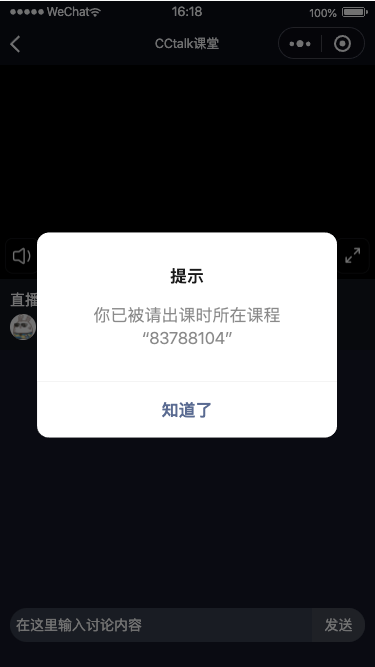

# 直播间


## **知识点**

* 小程序功能简介
* `socket` 基础知识
* `socket-service` 的连接机制
   *  断网重连的bug
* 播放器的设计
* 消息监听

## 0、 小程序功能简介

### 我的课程列表

* 账号登录
* 购买后的课程列表


### 网师主页

内嵌 web 端网师主页

需要隐藏 Web端价格标签，如价格、优惠活动等


### 课时学习页

包含 Web 端的群 intro 页和 三合一页面主体功能

* 视频播放、课时切换
* 群模块：网师、评价、推荐


### 直播间

* 在线直播播放
* 聊天消息列表


  
## 1、连接及socket-service服务

### Socket 连接原理

* HTTP 连接
* 长轮询
* Socket 的 WebSocket 连接


### 主要连接顺序

1. 创建  `socket`  连接，以  `wss` 协议
2. 验证  `service-token` 信息
3. 获取上麦人数、是否禁言、在线人数等
4. 监听多种消息类型，如普通消息、上麦、送鲜花等
  1. 请求指令
  2. 回应指令


### 连接库

基于  `socket.io` 实现，有  `socket.io`  Java 服务端和  `socket.io-client` 客户端版本

Web端使用  `socket.io-client` 的1.4.6版本

小程序端用的 `wxapp-socket-io` 的1.0.0版本，特点为编译后未压缩版本大小为60k，使用单socket连接

其核心逻辑为  `engine.js` 中有  `wx.connectSocket` 和  `wx.closeSocket` 的单任务连接机制

为何不使用 `wxapp-socket-io` 的最新版呢？

最新版实现的原理是基于`socket.io-client` 的 2.3.6版本，将其中 socket 连接部分

编译后未压缩版本大小为300k左右，且在分析namespace时会多一个 “,”，


```javascript
// 错误
/group123456,
/group123456,,invalid namespace
```
### 连接初始代码

1、io 连接  `wss.cctalk.com:8000/group123456` 其中  `wss.cctalk.com:8000` 为socket连接地址，`group123456` 为命名空间（群聊房间） 

```javascript
const socket = new Socket({
  store,
  userId: userInfo.userId,
  actions: liveActions,
  videoId: videoInfo.videoId,
  groupId: videoInfo.groupId
})
```
```javascript
export async function getSocketServer(groupId) {
  try {
    const res = await getWssInfo()
    return `wss://${(res.httpsHost).trim()}:8000/group${groupId}`
  } catch (e) {
    wsslogError(e, '获取 wss 地址失败')
    return null
  }
}
```
```json
 {
  "httpsHost": "swss.hjapi.com",
  "wssHost": "wss.cctalk.com",
  "wssPort": "8000"
}
```
```javascript
this.socket = io(server, {
  // 重连间隔
  reconnectionDelay: 50000,
  // 最大重连尝试次数
  reconnectionAttempts: 5,
})
```

2、获取  `service-token` ，校验token，此时才会认为  `socket` 登录成功

```javascript
const data = await this.actions.user.getSocketToken()
// 开始验证 token，当后续验证 token 通过时，才算登录成功
this.sendCMD(__code.SCMD_LOGIN_VERIFY_TOKEN_REQ, { content: data.token })  
```
```json
{
	"blackReason": "",
	"nickName": "xiaoxili22",
	"releaseTime": 0,
	"token": "6680462445615xxxxxx",
	"userId": 65875530,
	"userName": "xiaoxili22"
}
```
> 直播间socket连接的机制，命名空间、token校验、多次重连机制、10秒心跳重连

### 断网重连bug

bug表现：在用户断网后再次重连后，用户会被从参与列表中自动推出

#### 怀疑表现1

微信开发者工具没有问题，但小程序上就有问题

CCtalk web端直播间使用的每隔10秒请求一次群成员数量以此来判断是否连接成功

沪江网校的方案为每隔10秒会关闭Socket连接，再重新连接一次

但经过多次尝试，依然无效


客户端断开用户连接的时间为2分钟，2分钟内重连成功后不会将用户从用户列表移除。

#### 怀疑表现2

但通过测试，iPhone手机的 Safari 浏览器也有类似的bug，怀疑为Sever问题

表现为：

* 直接断开 80秒左右断开
* 25秒断开 80秒左右断开

Server同学在解决问题后，给出一下分析：

存在多个wss的情况下，会出现不能保证顺序执行用户离开再进入，会变成先进入再离开，所以断线后就连不上了。

对单次登录做了唯一uuid记录，离开的时候需要匹配uuid，否则直接不处理此次离开（认为非法）

这样先收到进入（新的uuid），再收到离开（老的uuid）。因为老的uuid跟新的uuid不匹配，所以做丢弃处理

## 2、播放器

### 视频 RTMP 格式

**小程序端**

`live-player` 的 src 支持 rtmp 格式，

首次使用  `videoInfo` 里面的 rtmp 地址，但也支持通过  `Socket`  指令来更换 rtmp 地址

**Web端**

HLS的m3u8方式

>HTTP Live Streaming（缩写是HLS）是一个由苹果公司提出的基于HTTP的流媒体网络传输协议。​是苹果公司QuickTime X和iPhone软件系统的一部分。 它的工作原理是把整个流分成一个个小的基于HTTP的文件来下载，每次只下载一些。当媒体流正在播放时，客户端可以选择从许多不同的备用源中以不同的速率下载同样的资源，允许流媒体会话适应不同的数据速率。
### 同层渲染

v2.9.1 起支持同层渲染

安卓手机上即使是最新版小程序基础库，还是会出现“静音”和“全屏”按钮按钮显示不出来，原因为嵌套不合理。

```xml
<!-- 错误 -->
<LivePlayer></LivePlayer>
<CoverView>全屏</CoverView>
```
```xml
<!-- 正确 -->
<LivePlayer>
  <CoverView>全屏</CoverView>
</LivePlayer>
```
 `CoverView` 对 CSS 和动画是部分支持的

* 只支持基本的定位、布局、文本样式。不支持设置单边的border、background-image、shadow、overflow: visible等。
* 不支持 CSS Animate 动画
## 3、状态监听

### 退出直播间

* 进入页面，从直播被变为回顾，自动返回课程学习页，并刷新视频播放区
* 老师主动结束直播，播放区提示
* 移除群成员，弹窗提示

| 老师主动结束 | 移除群成员 |
| --- | --- |
|  |  |

### 自动播放

* Wifi 自动开始播放
* 4G 提示消耗流量，再同意后才进行播放


**Wifi下自动播放**

```javascript
onFirstPlay = () => {
  const { playStatus } = this.state
  const { networkInfo } = this.props
  const { networkType } = networkInfo

  if (playStatus === PLAY_STATUS.INIT) {
    if (networkType === 'wifi') {
      this.onLivePlay()
    } else {
      this.setState({
        playStatus: PLAY_STATUS.LOADED
      })
    }
  } 
}
```
**4G 提示流量消耗**

```javascript
onToPlayBtn = () => {
  const { networkInfo } = this.props
  const { isConnected, networkType } = networkInfo

  if (!isConnected) {
    Taro.showToast({
      icon: 'none',
      title: '当前没有网络连接'
    })
    return
  }

  if (!this.toPlayed && networkType !== 'wifi') {
    this.toPlayed = true
    Taro.showModal({
      title: '提示',
      content: '当前没有WI-FI，直播将消耗流量',
      cancelText: '退出直播',
      confirmText: '继续',
      success: (res) => {
        if (res.confirm) {
          this.onLivePlay()
        } else if (res.cancel) {
          this.onLivePause()
        }
      }
    })
    return
  }
  
  this.onLivePlay()
}
```
## 4、消息发送

### 消息合并


消息合并，简化版分组的概念

* 移动端app和pc客户端都需要将本地消息与网络消息进行合并，并且也有消息记录的概念
* 小程序直播间：只有网络消息，只记录从进入、离开聊天室这一段时间

在最新的消息基础上增加一条时间类型消息

* 第一条
* 最新消息与次新消息间隔5分钟

### 【暂时废弃】输入法高度

input的 `adjust-position` 导致整个页面上推，即使是fixed的直播播放区

（少一张图？）

改为监听输入法高度

安卓中文输入法，不跟手

* 改变ScrollView高度影响scroll区域，导致“新消息”的气泡提示有问题。
* 分离聊天消息列表与输入框

input focus时，聊天消息列表高度不变，而input输入框位置跟随输入法做偏移，使用css动画做简单偏移动画


方案1：

`onScrollToLower` 方法默认距离底部50px触发，但之后  `onScroll` 依旧会触发

 

需要在 `onScroll` 判断距离底部位置，模拟滚动到底部


方案2：

高1px的元素是否在视图在内，监听新消息泡泡

 `ScrollView` 的   `scrollToView` 快速跳转位置

新消息来时需要滚动到底部时，加一个状态，以此来将监听暂时无效化

与CCtalk app上的交互类似，当input 聚焦及全屏操作时，认为离开了聊天消息区域，此时需要将聊天消息区域自动滚动到最底部，

 

### 输入框及聊天区域优化

CCtalk APP在输入法弹出时会改变聊天消息区域高度


小程序端采取输入框跟随键盘位置，但聊天消息区域高度不变

并加入了css延迟动画，以模拟贴合输入法高度变化的情况


### 大小表情

表情map表，在直播间、回顾

 `bhzh` 对应的是 `https://cc.hjfile.cn/cc/face/pc/big_hh/1.gif`

```json
{
  "bhzh": "pc/big_hh/1"
}
```
小表情支持图文混合

大表情为单独的一条


### 富文本与复制

小程序的  `RichText` 会将 HTML 标签给尝试编译出来

```xml

```
但用户随意乱打的，也可能会被解析

```plain
<abcderjewirewior/>
```
所以可以将HTML进行转义

```javascript
export function encodeHTML(str) {
  let deChar = ['<', '>', '"', '×', '÷']
  let enChar = ['&lt;', '&gt;', '&quot;', '&times;', '&divide;']
  
  str += ''
  deChar.map((c, i) => str = str.replace(new RegExp('\\' + c, 'ig'), enChar[i]))
  
  return str.replace(/\/imbr/ig, '<br/>')
}
```
复制消息时，仅支持复制整条消息，并且要将其中的  `` 和  `<br />` 标签给去除


---


socket.io的多个库，socket task任务的机制

断网重连的bug，因为socket没有完全关掉

寻找重连次数在哪里执行的？

寻找原因及解决方案，白天处理！

拷贝关闭消息的那一条，应该是一个错误语句

断网重连的次数设置为0！


第二次的token？还是触发了一次关闭的原因？

先去找市面上的文章，寻找思路！

[https://github.com/zimv/websocket-heartbeat-miniprogram](https://github.com/zimv/websocket-heartbeat-miniprogram)


询问server端原因

服务端的socket问题？

uuid的问题？

| 时间   | 触屏 safari   |    |    | 
|:----|:----|:----|:----|
| 10秒   |    |    |    | 
| 25秒   | 70秒  44秒   |    |    | 
| 60秒   |    |    |    | 


直接断开 80秒左右断开

25秒断开 80秒左右断开

25+60=85


